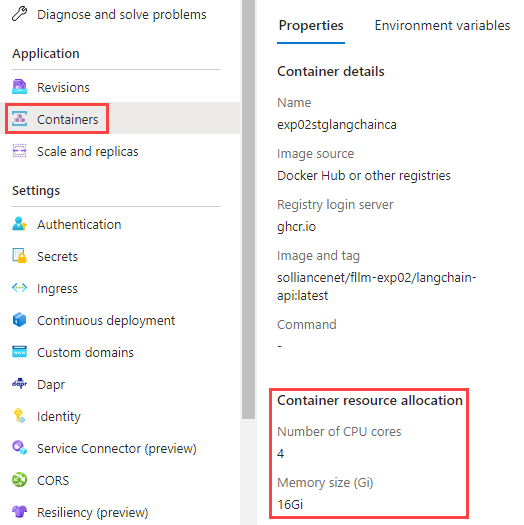

# Post-Deployment Considerations: Scale LangChain Instances

Because of the memory- and compute-intensive nature of preparing data sources for inference, users should consider scaling the resources available to the LangChain Azure Container Apps instance.

## Prerequisites

1. [Azure CLI](https://learn.microsoft.com/en-us/cli/azure/install-azure-cli) with correct tenant and subscription settings

   >**Note:** Use the `az login` and `az account set` commands to change the tenant and subscription context, respectively.

2. Sufficient Azure RBAC Permissions:
   1. Write permissions (`microsoft.app/containerapps/write`) on the desired Container App

## Scaling Procedure

1. Use the Azure CLI to raise the instance resource limits. Substitute `[PREFIX]` and `[DEPLOYMENT RESOURCE GROUP]` appropriately.

    ```bash
    az containerapp update --name "[PREFIX]langchainca" --resource-group "[DEPLOYMENT RESOURCE GROUP]" --cpu 4.0 --memory 16.0Gi --min-replicas 1 --max-replicas 1
    ```

    >**Note:** FLLM's authors do not recommend scaling beyond one LangChain instance.

2. To verify that scaling completed successfully, navigate to the `[PREFIX]langchainca` instance. Select **Containers** and confirm the **Container resource allocation**.

    

    >**Note:** If you cannot see the updated resource limits, navigate to the **Revisions** tab. The updated deployment may not have completed yet.
