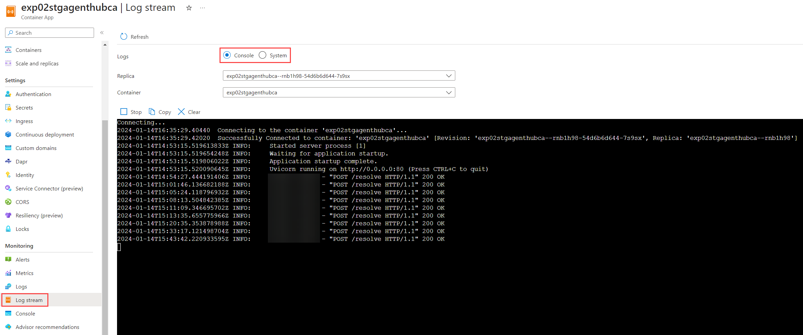

# Updating Deployment Images

Periodically upgrading your FoundationaLLM deployment's Docker images is recommended to take advantage of performance, security, and functionality improvements.

This guide provides two update options: Scripted deployment, which updates all containers, and individual deployment, which targets a specific container. Both deployment mechanisms use the Azure CLI.

## ACA Steps

### Prerequisites

1. [Azure CLI](https://learn.microsoft.com/en-us/cli/azure/install-azure-cli) with correct tenant and subscription settings

   >**Note:** Use the `az login` and `az account set --subscription "[SUBSCRIPTION ID]"` commands to change the tenant and subscription context, respectively.

2. Sufficient Azure RBAC Permissions:
   1. Write permissions (`microsoft.app/containerapps/write`) on the desired Container App
   2. App Configuration Key-Value Store Write (`Microsoft.AppConfiguration/configurationStores/keyValues/write`)

3. (Scripted Update Only) Cross-Platform [PowerShell](https://learn.microsoft.com/en-us/powershell/scripting/install/installing-powershell?view=powershell-7.4)

### Key Vault Update Steps

1. Consult the image release notes and make note of any required App Configuration parameter changes. Changes can be propagated to the App Configuration instance through the `az appconfig kv set` command.

   ```bash
   az appconfig kv set --name "[DEPLOYMENT APP CONFIG NAME]" --key "" --value ""
   ```

### Deployment Option 1: Scripted Update

The automated script provided in this deployment package allows users to update the image version for *all* containers in the deployment. It will fail if any container cannot be updated.

1. Open a terminal window and change the directory to the location of the script.

2. The script accepts six parameters, three of which are required. After deciding which parameters are necessary, call the script.

   | Name | Flag | Optional | Default Value |
   | ---- | ---- | -------- | ------------- |
   | Deployment Resource Group | `-resourceGroup` | False | N/A |
   | Deployment Prefix | `-resourcePrefix` | False | N/A |
   | Deployment Subscription | `-subscription` | False | N/A |
   | Image Repository | `-containerPrefix` | True | `solliancenet/foundationallm` |
   | Image Tag | `-containerTag` | True | `latest` |
   | Registry | `-registry` | True | `ghcr.io` |

   For example, the following invocation provides a specific image tag. Customers are strongly encouraged to use a specific deployment tag, rather than the generic `latest` tag.

   ```powershell
   ./update-tags.ps1 `
      -resourceGroup "[DEPLOYMENT RESOURCE GROUP]" `
      -resourcePrefix "[DEPLOYMENT PREFIX]" `
      -subscription "[DEPLOYMENT SUBSCRIPTION]" `
      -containerTag "[IMAGE TAG]"
   ```

### Deployment Option 2: Individual Container Update

Use the following Azure CLI command to create a new Container App revision targeting the updated image. Customers are strongly encouraged to use a specific deployment tag, rather than the generic `latest` tag.

```bash
az containerapp update --name "[CONTAINER APP INSTANCE NAME]" --resource-group "[DEPLOYMENT RESOURCE GROUP]" --image "[IMAGE URI WITH SHA]"
```

>**Note:** You may be prompted to accept the installation of the `containerapp` extension.

>**Note:** If you encounter any deployment errors, ensure that you are running a recent version of the Azure CLI (`az version`).

The following table maps the product API name to the Container App instance name.

| API | Container Name |
| --- | -------------- |
| Core API | `[PREFIX]coreca` |
| Agent Factory API | `[PREFIX]agentfactoryca` |
| Agent Hub API | `[PREFIX]agenthubca` |
| Chat UI | `[PREFIX]chatuica` |
| Core Job API | `[PREFIX]corejobca` |
| Data Source Hub API | `[PREFIX]datasourcehubca` |
| Gatekeeper API | `[PREFIX]gatekeeperca` |
| Gatekeeper Integration API | `[PREFIX]gatekeeperintca` |
| LangChain | `[PREFIX]langchainca` |
| Management API | `[PREFIX]managementca` |
| Management UI | `[PREFIX]managementuica` |
| Prompt Hub API | `[PREFIX]prompthubca` |
| Semantic Kernel API | `[PREFIX]semantickernelca` |
| Vectorization API | `[PREFIX]vectorizationca` |
| Vectorization Worker | `[PREFIX]vectorizationjobca` |

### Verification

To ensure that the image(s) deployed successfully, verify that there are no container startup issues. Access the container logs using the **Log stream** tab in the Azure portal.


