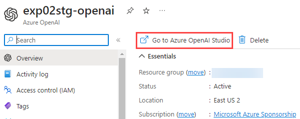
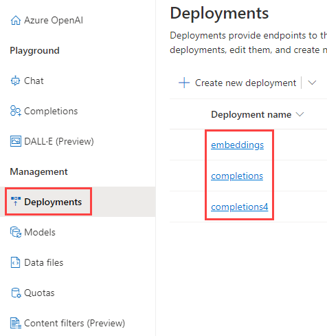
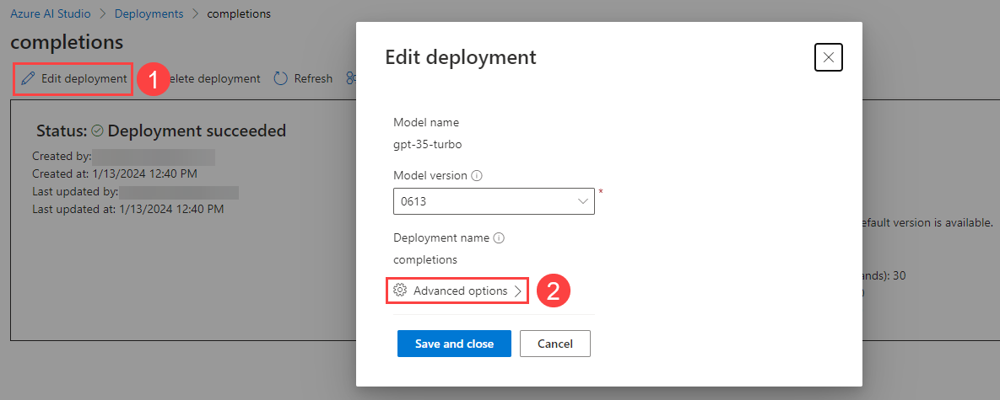
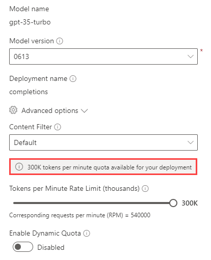

# Deployment Considerations: OpenAI Quota Limit

For optimal performance, users should deploy FoundationaLLM in a subscription with no other Azure OpenAI workloads, permitting maximum performance.

1. Navigate to the Azure OpenAI resource in the deployment resource group. On the **Overview** page, select **Go to Azure OpenAI Studio**.

    >**Note:** Alternatively, users can access Azure OpenAI Studio at [oai.azure.com](https://oai.azure.com)

    

2. At the left-hand side of the page below the **Management** header, select the **Deployments** tab.

    

3. For each deployment:
   1. Select **Edit deployment** and **Advanced options**.

        

   2. Verify the tokens per minute quota for the deployment. Adjust the quota as needed.

        

        To determine if other OpenAI workloads are running in your environment, confirm whether there is a difference between the available quota for the model and the [Azure regional quota for the model.](https://learn.microsoft.com/en-us/azure/ai-services/openai/quotas-limits)

        >**Note:** Viewing model quota will require the **Cognitive Services Usages Reader** role assigned to the user account on the Azure subscription.
